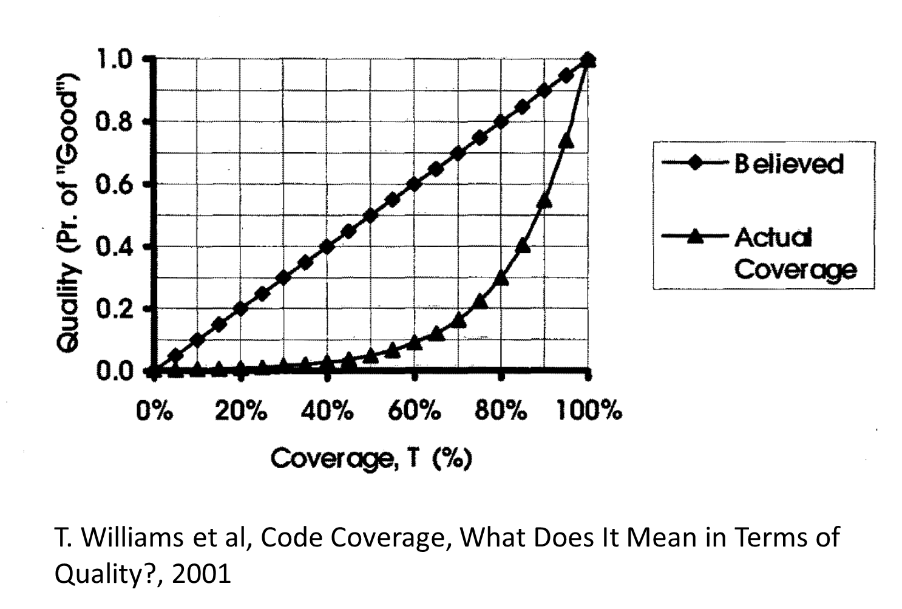
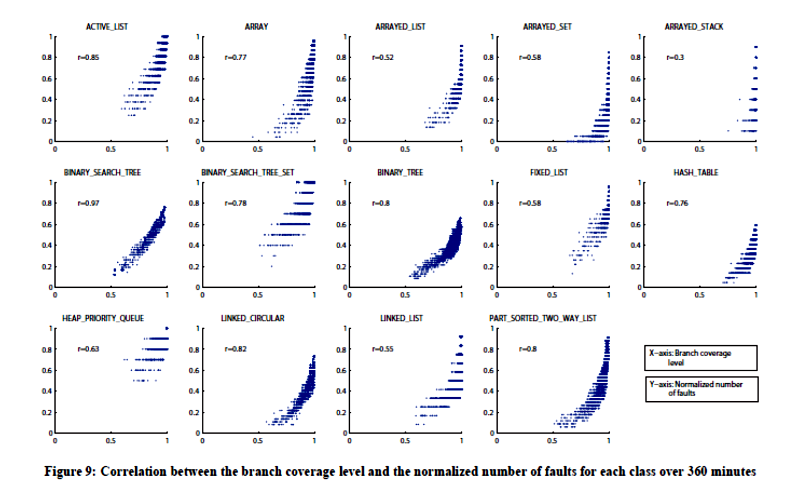

# Does coverage represent the quality.

Popular belief & theoretical model

*(T. Williams et al, Code Coverage, What Does It Mean in Terms of Quality?, 2001)*

Empirical findings

*(Wei et al, Is Coverage a Good Measure of Testing Effectiveness? An Assessment Using Branch Coverage and Random Testing)*

Caveat: 100% refers to the totality of faults found, not to the totality of faults that might exist

What do you make of these charts? Unit code Test Coverage has long been known to be an important metric for testing software, and many development groups require 85% coverage to achieve quality targets. Assume we have a test, T1, which has 100% code coverage and it detects a set of defects, D1• The question, which will be answered here, is "What percentage of the defects in D1 will be detected if a random subset of the testes in T 1 are applied to the code, which has code coverage of X% of the code?''
