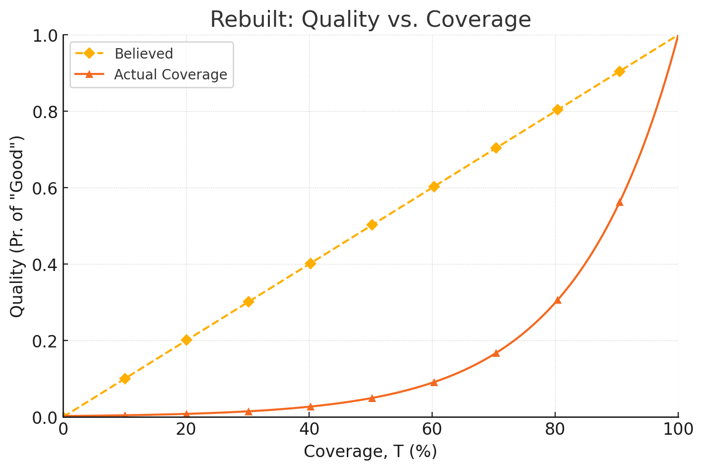

---
TEST

- $T$: coverage fraction (e.g., 0.7 for 70%)
        
- $p$: defect probability per statement
        
- $n$: number of code statements

$Q_{\text{actual}}(T) = \left( \frac{1 - p}{1 - pT} \right)^n$        

---

# Does Coverage Represent Software Quality?

## Key Idea

Many believe that **code coverage** (how much code is exercised by tests) is a direct indicator of software quality. But how accurate is this belief?

---

## Popular Belief vs. Theoretical Model

*Reference: T. Williams et al, “Code Coverage: What Does It Mean in Terms of Quality?”, 2001* 


### Popular Belief:

- _“If I test 50% of the code, I catch 50% of the defects.”_  
    This assumes defects are **evenly distributed** and detected in proportion to coverage.
    

### Theoretical Model (Hypergeometric + Binomial):

- In reality, **defects can cluster** in untested parts of the code.
    
- Even at **70% coverage**, there’s a significant chance you missed all critical defects.
    
- **Mathematical formula** (simplified):
    
$$
Q_{\text{actual}}(T) = \left( \frac{1 - p}{1 - pT} \right)^n
$$
    
where:
    
- $$T$$: coverage fraction (e.g., 0.7 for 70%)
        
- $$p$$: defect probability per statement
        
- $$n$$: number of code statements
        

### Key Takeaway:

- **Popular belief**: “70% coverage ⇒ 70% chance code is defect-free.”
    
- **Reality**: “70% coverage ⇒ maybe 5–10% chance of no lurking defects.”
    

---

## Empirical Findings

**Reference: Wei et al, “Is Coverage a Good Measure of Testing Effectiveness?”, 2010**  


- **Experiments** show that **fault detection** initially rises with branch coverage but later continues even when coverage plateaus.
    
- In early testing, **more coverage** = **more faults found**.
    
- Later, even with little new coverage, testers keep finding new faults.
    
- **Conclusion**: Coverage is a good start but not a complete measure of test effectiveness.

{: .highlight }
Caveat -  100% refers to the totality of faults found, not to the totality of faults that might exist
    

---

## Summary of Main Findings (Williams et al, 2001)

1. **Coverage ≠ Defect-Free Code**  
    100% coverage **does not guarantee all defects are found**.
    
2. **Mathematical Model**  
    Assumes **defects randomly distributed** across code.  
    Uses **binomial and hypergeometric models** to calculate quality vs. coverage.
    
3. **Exponential Fault Detection Growth**  
    **Defect detection grows faster than coverage**—but not linearly.  
    Gains **flatten after ~85–90% coverage**.
    
4. **Formula for Quality vs. Coverage**:
    

$$
Q = 1 - (1 - P_e)^{n(1 - T)}
$$

- $$T$$: code coverage fraction
    
- $$P_e$$: defect probability per statement
    
- $$n$$: total number of statements
    

5. **Key Implications**
    
    - **85% coverage** is a **meaningful industry target**—but even then, some defects might remain.
        
    - **Random subsets** of tests can miss different defects.
        

Coverage is necessary but insufficient to ensure software quality. Defect detection grows with coverage—but with diminishing returns, and never guarantees completeness.

---

## Key Observations from Wei et al (2010) 

1. **Early Phase: High Gains**  
    Branch coverage and fault detection rise together.  
    Example: In 10 min of testing, **93% of branch coverage** and **54% of faults** are achieved.
    
2. **Plateau Phase: Diminishing Returns**  
    After initial rise, coverage increases very little, but **fault detection continues**.  
    Over **50% of faults found during plateau phase**.
    
3. **Coverage–Fault Correlation Varies**  
    Correlation between coverage and fault detection varies greatly by code area (from weak r=0.3 to strong r=0.97).
    
4. **Implications**
    
    - Early in testing, **coverage is a good indicator**.
        
    - Later, **coverage stops being useful**—new faults can still emerge.
        

---

## Conclusion

- **Code coverage is essential** for testing effectiveness but is **not a perfect measure of quality**.
    
- To improve software reliability:
    
    - Aim for **high coverage** (e.g., 85%+), but don’t stop there.
        
    - Use **diverse test sets**—don’t rely on one method.
        
    - Recognize that **100% coverage does not mean defect-free software**.
        

### References

