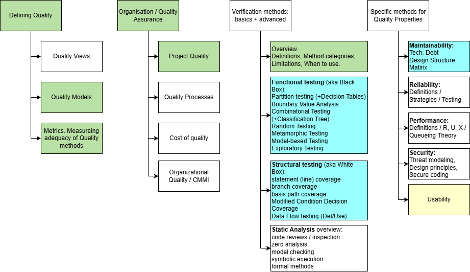

# Software Quality and Reliability 📘

Welcome to the course notes repository for **Software Quality and Reliability** (with occasional insights on Security and other properties). 
This resource aims to provide a comprehensive overview of key topics, combining theoretical foundations with practical applications. Whether you're a student, professional, or curious learner, these notes are here to guide you.

---

## 📊 Overview  

Below is a visual overview of the key topics covered in this repository:

  

---

## 📂 Areas Covered  

### 1. [Defining Quality](/sqrbok/definition/) 👥  
Understand the essence of software quality:  
- Quality views and perspectives  
- Quality models and metrics  
- Evaluating the adequacy of quality measures  

---

### 2. [Organizing Quality](/sqrbok/organization/) 🔄  
Explore how to manage and assure quality effectively:  
- The cost of quality  
- Project-level quality management  
- Quality processes in organizations  
- Organizational strategies for software quality  

---

### 3. [Verification and Validation](/sqrbok/verification/) 📏  
Learn methods to ensure software reliability and correctness:  
- Functional testing (Black Box testing)  
- Structural testing (White Box testing)  
- Static analysis techniques  

---

### 4. [Quality Attributes](/sqrbok/attributes/) 🧩  
Dive into key software quality attributes:  
- Maintainability  
- Reliability  
- Security  
- Usability  

---

### 5. [Selected Materials](/sqrbok/material/) 📚  
Access curated references and resources:  
- Books  
- Research papers  
- Guides and online courses  

---

## 🛠️ Resources  

- **Contribution Template**: [Get started with the contribution template](/sqrbok/template/)  
  Help us improve these notes by following the provided contribution guidelines.

---

### 🎯 Objective  

These course notes aim to:  
- Provide a structured and accessible overview of software quality and reliability topics.  
- Equip readers with insights that bridge theoretical concepts and real-world applications.  
- Encourage collaboration and knowledge-sharing within the community.

---

Feel free to explore, contribute, and enhance your understanding of software quality and reliability!